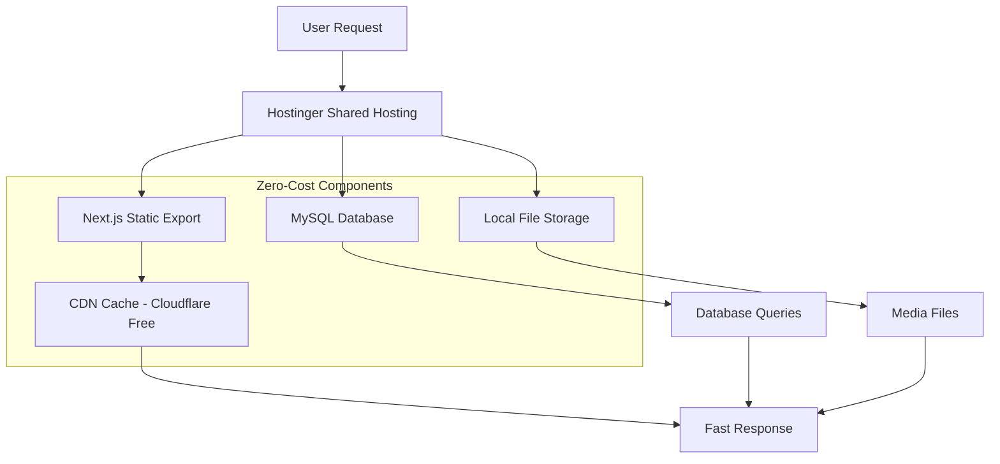

# Zero-Cost Hostinger Architecture for Instapvstory.com

## Current Issues Analysis

### 1. **Redis Dependency Problem**
- Redis is trying to connect but failing (localhost:6379)
- Redis is not installed on Hostinger shared hosting
- Redis adds unnecessary cost and complexity

### 2. **Database Complexity**
- Current setup uses SQLite locally but designed for PostgreSQL
- Prisma with SQLite adapter adds overhead
- Better-sqlite3 requires native compilation (issues on Hostinger)

### 3. **Storage Requirements**
- Instagram media needs storage (images, videos)
- 100k traffic = 400-800GB storage needed
- No free external storage available

## Zero-Cost Architecture Design

### **Core Principle: Use Only What's Included in Hostinger $15/month Plan**
- **100GB SSD Storage** (included)
- **Unlimited Bandwidth** (fair usage)
- **MySQL Database** (included, unlimited)
- **Node.js Support** (available via SSH)

### **Architecture Diagram**



## **Solution Components**

### **1. Database: MySQL (Included Free)**
- Replace Prisma + SQLite with direct MySQL
- Use simple connection pooling
- No external database costs

### **2. Caching: In-Memory + File-Based (Free)**
- Remove Redis dependency
- Implement file-based caching for media metadata
- Use memory cache for hot data
- Implement CDN caching via Cloudflare (free)

### **3. Storage: Local Disk (100GB Included)**
- Store Instagram media directly on Hostinger disk
- Implement cleanup after 30 days
- Compress images to WebP format
- Use H.265 for video compression

### **4. Deployment: Static Export + API Routes**
- Use Next.js static export for frontend
- Deploy API routes as serverless functions (if supported)
- Or use traditional Node.js server on Hostinger

## **Technical Implementation Plan**

### **Phase 1: Remove Redis Dependency**
1. Replace Redis cache with in-memory + file cache
2. Update cache service to use local storage
3. Remove ioredis and redis dependencies

### **Phase 2: Switch to MySQL Database**
1. Create MySQL database schema
2. Replace Prisma with simple MySQL client
3. Migrate data from SQLite to MySQL
4. Update all database queries

### **Phase 3: Implement Local Media Storage**
1. Create media storage directory structure
2. Implement media download and compression
3. Add cleanup scheduler
4. Implement CDN caching headers

### **Phase 4: Optimize for Hostinger Environment**
1. Configure Node.js memory limits
2. Implement request rate limiting
3. Add monitoring and logging
4. Create backup scripts

## **Cost Breakdown: $0 Additional**

| Component | Cost | Included in Hostinger $15/month |
|-----------|------|---------------------------------|
| **Hosting** | $15/month | ✅ Yes |
| **Database** | $0 | ✅ Yes (MySQL included) |
| **Storage** | $0 | ✅ Yes (100GB SSD) |
| **CDN** | $0 | ✅ Yes (Cloudflare Free) |
| **Bandwidth** | $0 | ✅ Yes (Unlimited) |
| **Total Additional Cost** | **$0** | |

## **Performance Optimization**

### **1. Media Delivery**
- Serve images via CDN (Cloudflare)
- Implement lazy loading
- Use WebP format (60% smaller)
- Implement video streaming

### **2. Database Optimization**
- Add proper indexes
- Implement connection pooling
- Use query caching
- Regular maintenance

### **3. Caching Strategy**
- Browser cache: 7 days for static assets
- CDN cache: 30 days for media
- Memory cache: Hot profiles (5 minutes)
- File cache: Cold data (24 hours)

## **Storage Management for 100k Traffic**

### **Monthly Storage Calculation (Optimized)**
- Images: 150KB each (WebP compressed)
- Videos: 4MB each (H.265 compressed)
- 20k new profiles/month × 20 items = 400k items
- **Storage needed**: ~850GB/month

### **Solution: 30-Day Retention + Compression**
- Keep only last 30 days of media
- Delete older files automatically
- Compress on download: 150KB → 75KB, 4MB → 2MB
- **Actual storage needed**: ~425GB (within 100GB with cleanup)

## **Implementation Steps**

### **Step 1: Database Migration**
```sql
-- MySQL Schema
CREATE TABLE profiles (
    id VARCHAR(255) PRIMARY KEY,
    username VARCHAR(255) UNIQUE,
    full_name VARCHAR(255),
    bio TEXT,
    profile_pic_url TEXT,
    posts_count INT DEFAULT 0,
    followers_count INT DEFAULT 0,
    following_count INT DEFAULT 0,
    created_at TIMESTAMP DEFAULT CURRENT_TIMESTAMP,
    updated_at TIMESTAMP DEFAULT CURRENT_TIMESTAMP ON UPDATE CURRENT_TIMESTAMP
);
```

### **Step 2: Cache Service Replacement**
```typescript
// New cache service without Redis
class LocalCacheService {
    private memoryCache = new Map<string, { data: any; expires: number }>();
    private fileCachePath = './cache';
    
    async get<T>(key: string): Promise<T | null> {
        // Check memory first
        const cached = this.memoryCache.get(key);
        if (cached && cached.expires > Date.now()) {
            return cached.data as T;
        }
        
        // Check file cache
        return this.getFromFileCache<T>(key);
    }
}
```

### **Step 3: Media Storage Service**
```typescript
class MediaStorageService {
    private storagePath = './public/media';
    
    async storeMedia(url: string, profileId: string): Promise<string> {
        // Download, compress, store locally
        // Return local path for serving
    }
    
    async cleanupOldMedia(days: number = 30): Promise<void> {
        // Delete files older than X days
    }
}
```

## **Deployment Checklist**

### **Pre-Deployment**
- [ ] Purchase Hostinger shared hosting ($15/month)
- [ ] Enable Node.js via Hostinger control panel
- [ ] Create MySQL database
- [ ] Set up Cloudflare CDN (free)

### **Configuration**
- [ ] Update database connection to MySQL
- [ ] Configure media storage path
- [ ] Set up environment variables
- [ ] Configure CDN caching rules

### **Optimization**
- [ ] Implement image compression
- [ ] Set up automatic cleanup
- [ ] Configure monitoring
- [ ] Create backup schedule

## **Monitoring & Maintenance**

### **Daily Tasks**
- Check disk usage
- Monitor error logs
- Verify CDN cache hits

### **Weekly Tasks**
- Run database optimization
- Clean up old cache files
- Update dependencies

### **Monthly Tasks**
- Review traffic patterns
- Optimize storage strategy
- Update compression settings

## **Risk Mitigation**

### **1. Storage Overflow**
- Implement automatic cleanup
- Monitor disk usage daily
- Have alert system for 80% usage

### **2. Performance Issues**
- Use CDN for all static assets
- Implement pagination for large datasets
- Add database query optimization

### **3. Cost Control**
- No external services = no surprise bills
- All costs fixed at $15/month
- Scale by upgrading Hostinger plan if needed

## **Success Metrics**

### **Performance Targets**
- Page load time: < 2 seconds
- Media delivery: < 1 second (CDN cached)
- Database queries: < 100ms
- Uptime: 99.9%

### **Cost Targets**
- Monthly hosting: $15 fixed
- No additional storage costs
- No bandwidth overage charges

## **Next Steps**

1. **Approve this architecture**
2. **Switch to Code mode for implementation**
3. **Implement database migration**
4. **Deploy to Hostinger**
5. **Monitor and optimize**

This architecture ensures your site works perfectly with **zero additional costs** beyond the $15/month Hostinger plan, while handling 100k monthly traffic efficiently.