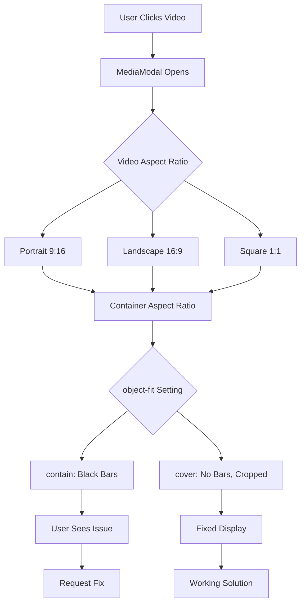

# Video Display Fixes Plan

## Problem Analysis
The user reported two issues with video display in the Instapvstory.com application:

1. **Black spaces on right and left sides of video** - When playing videos, there are black bars on the sides
2. **Height issues** - Videos should have proper height display

## Root Causes Identified

### 1. MediaModal Component Issues
- **File**: `src/components/viewer/MediaModal/MediaModal.module.css`
- **Issue**: `.media` class uses `object-fit: contain` (lines 72-76)
- **Result**: Maintains aspect ratio but creates black bars when aspect ratios don't match
- **Current CSS**:
  ```css
  .media {
    max-width: 100%;
    max-height: 100%;
    object-fit: contain;
  }
  ```

### 2. Container Constraints
- **File**: `src/components/viewer/MediaModal/MediaModal.module.css`
- **Issue**: `.mediaArea` has `min-height: 400px` (line 62) and `.imageWrap` has `min-height: 500px` (line 69)
- **Result**: Fixed heights may not adapt to different video aspect ratios

### 3. PostsGrid Component (Working Correctly)
- **File**: `src/components/viewer/PostsGrid/PostsGrid.tsx`
- **Observation**: Videos in grid use `object-fit: cover` (line 88) which fills container without black bars
- **Current working code**:
  ```tsx
  style={{ objectFit: 'cover', width: '100%', height: '100%' }}
  ```

## Solution Strategy

### Fix 1: Change object-fit from "contain" to "cover"
- **Location**: `src/components/viewer/MediaModal/MediaModal.module.css`
- **Change**: `.media { object-fit: contain; }` → `.media { object-fit: cover; }`
- **Benefit**: Eliminates black bars by filling the entire container
- **Consideration**: May crop video edges if aspect ratios differ significantly

### Fix 2: Improve Container Responsiveness
- **Location**: `src/components/viewer/MediaModal/MediaModal.module.css`
- **Changes**:
  1. Remove fixed `min-height` from `.mediaArea`
  2. Make `.imageWrap` more flexible
  3. Add responsive height constraints
- **Benefit**: Better adaptation to different video sizes

### Fix 3: Add Video-specific Styles
- **Location**: `src/components/viewer/MediaModal/MediaModal.module.css`
- **Addition**: Create separate styles for video elements
- **Example**:
  ```css
  video.media {
    width: 100%;
    height: 100%;
    object-fit: cover;
  }
  ```

### Fix 4: Ensure Full Container Coverage
- **Location**: `src/components/viewer/MediaModal/MediaModal.tsx`
- **Change**: Add inline styles or class modifications to video element
- **Example**: Add `style={{ width: '100%', height: '100%' }}` to video element

## Implementation Steps

### Step 1: Update MediaModal CSS
1. Change `object-fit: contain` to `object-fit: cover` for `.media` class
2. Remove or adjust fixed `min-height` values
3. Add responsive container styles

### Step 2: Update MediaModal Component
1. Ensure video element has proper width/height attributes
2. Consider adding aspect ratio preservation for different video types

### Step 3: Test Different Video Formats
1. Test with portrait videos (9:16)
2. Test with landscape videos (16:9)
3. Test with square videos (1:1)

### Step 4: Add Responsive Breakpoints
1. Ensure mobile responsiveness
2. Adjust styles for different screen sizes

## Alternative Approaches

### Approach A: Smart Aspect Ratio Detection
- Detect video aspect ratio on load
- Apply `object-fit: contain` or `cover` based on container vs video ratio
- More complex but preserves content better

### Approach B: Dynamic Container Resizing
- Resize container to match video aspect ratio
- Eliminates need for object-fit cropping
- Requires JavaScript calculation

## Recommended Implementation

Given the user's request to "remove the black spaces", **Approach A** (changing to `object-fit: cover`) is the simplest and most effective solution. This matches how videos are displayed in the PostsGrid component which already works correctly.

## Files to Modify

1. **Primary**: `src/components/viewer/MediaModal/MediaModal.module.css`
2. **Secondary**: `src/components/viewer/MediaModal/MediaModal.tsx` (if needed)

## Testing Checklist
- [ ] Videos fill entire modal container without black bars
- [ ] Video controls remain accessible
- [ ] Different aspect ratios display correctly
- [ ] Mobile responsiveness maintained
- [ ] Image display unaffected by changes

## Mermaid Diagram: Video Display Flow



## Next Steps
1. Switch to Code mode to implement CSS changes
2. Test the fixes with different video types
3. Verify mobile responsiveness
4. Deploy changes if satisfactory